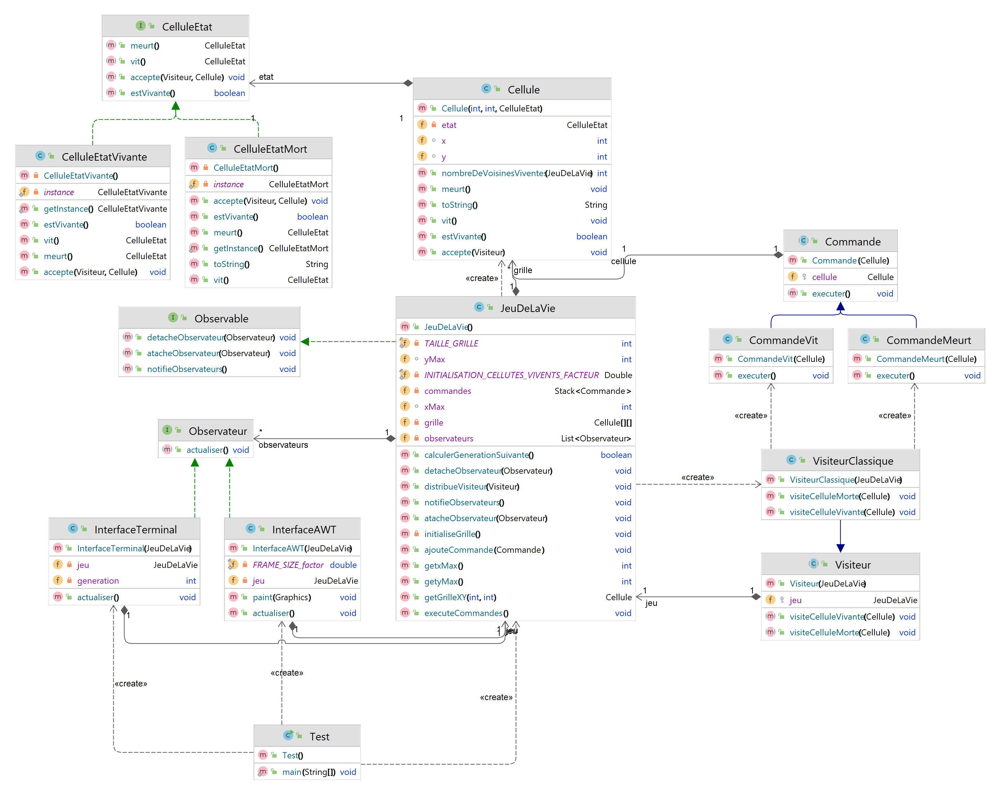

# Jeux de la vie
Auteur : Yoann LE GLEAU 

Ce document est issu du projet suivent [TP3 Jeux de la vie](https://github.com/yoannlegleau/DesingPatternL3/tree/master/src/jeu_de_la_vie).

---

## Description
Implementation du jeu de la vie en Java dans le cadre du [TP3](doc/Jeu de la Vie.html) sur les Design Patterns.

regle de base du [jeux de la vie](https://conwaylife.com/wiki/Conway%27s_Game_of_Life)

## Design Pattern

### Pattern de creation d'objet
| Pattern            | Utiliser    | Utilisation                                                                             |
|--------------------|-------------|-----------------------------------------------------------------------------------------|
| Singleton          | ✅          | Permet de créer une seule instance des classes CelluleEtatMort et CelluleEtatVivante    |
| Fabrique           | TP1-Canards |                                                                                         |
| Fabrique Abstraite | TP1-Canards |                                                                                         |
| Monteur            | ✅           | Permet de cree des JeuDeLaVie avec des parametre diferent ou par defaus plus facilement |
| Prototype (clone)  | ❌           |                                                                                         |

### Pattern structurels
| Pattern                 | Utiliser    | Utilisation                                                                         |
|-------------------------|-------------|-------------------------------------------------------------------------------------|
| Adaptateur              | TP1-Canards |                                                                                     |
| Pont                    | ❌           |                                                                                     |
| Composite               | TP2-Fichier |                                                                                     |
| Décorateur              | TP1-Canards |                                                                                     |
| Façade                  | ✅           | permet de fournire une interface simplifiée du jeux de la vie au interfaces graphiq |
| Poids mouche            | 🧠          |                                                                                     |
| Procuration (proxi/bdd) | 🧠          |                                                                                     |

### Pattern comportementaux
| Pattern                  | Utiliser    | Utilisation                                                                         |
| ------------------------ |-------------|-------------------------------------------------------------------------------------|
| Chaîne de responsabilité | TP1-Canards |                                                                                     |
| Commande                 | ✅           | Permet d'enregistre les modification de la grille (classe Commande)                 |
| Itérateur                | ✅           | Permet de pacourire les celule d'une grille de sellule infinie                      |
| Médiateur                | ✅           | Permet de gerer les diferante action/evenelment de l'interface de facon centraliser |
| Mémento                  | 🧠          |                                                                                     |
| Observateur              | ✅           | Permet de mètre a jour l'interface après les calcules                               |
| État                     | ✅           | Permet de savoir si une cellule est morte ou vivante                                |
| Stratégie                | ✅          | Permet de selectioner la methode d'initialisation de la grille (densiter)           |
| Patron de méthode        | ❌           |                                                                                     |
| Visiteur                 | ✅           | Permet d'implémenter plusieurs Règles (basique …)                                   |

# diagramme de classe

## Diagramme de classe de la première version

# Amélioration

## TODO
- [x] Interface grafique en AWT
- [ ] Écrire observateur/visiteur qui compt le nombre de cellule vivante ou morte
- [x] Écrire observateur qui compt le nombre de generation
- [ ] Règles alternatives (classique) [wiki JDLV](https://conwaylife.com/wiki/Main_Page): [liste de règles](https://conwaylife.com/wiki/List_of_Life-like_rules)
  - [x] [HighLife](https://conwaylife.com/wiki/OCA:HighLife)
  - [ ] [Day & Night](https://conwaylife.com/wiki/OCA:Day_%26_Night)
  - [ ] [Maze](https://conwaylife.com/wiki/OCA:Maze)

- [X] Bouton pour exécuter/arrêter la boucle d’exécution
- [X] Bouton pour avancer d’une génération lorsque la boucle est arrêtée ;
- [X] Slider pour ajuster la vitesse de la boucle d’exécution ;
- [x] Contrôle de sélection des règles du jeu, etc.
- [ ] Catalog de structure (depart)
- [x] variateur de la densité de depart si sélectionner
- [x] pattern strategi + factory pour l'initialisation de la grille
  - [x] aleatoire / densité
  - [ ] pattern
- [ ] grille infinie (18446744056 milliards de cellules)
  - [x] affichage d'une partie de la grille
  - [ ] deplacement de la "camera"
    - [ ] drag and drop
    - [x] touch directionnel
  - [x] zoom
- [X] Stopper la generation quand tout est fixe
- [ ] methode de Undo (pattern memento)
- [x] pattern Mediator pour la gestion de l'interface de creation de grille (class InterfaceGraphiqueSwing)
- [x] pattern facade pour la gestion de l'interface avec jeux de la vie
  - [ ] detailer doc
- [ ] pattern poids mouche pour la gestion des cellule dans l'inteface
  - intrinsèque: etat , position
  - extrinsèque: couleur / image / taille ...
- [x] pattern monteur pour la creation de JeuxDeLaVie 

## Interface grafique

Cette partie porte sur l'implémentation de l'interface graphique.
Swing sera la librairie graphique principal.
AWT sera utiliser pour certain element graphic mois générique.

3 options ont été envisager :
- AWT
- Swing
- JavaFX

Les principales raison de l'utilisation de Swing sont :
- Swing est tout comme AWT une bibliothèque graphique de Java.
- Swing est plus stable que AWT sur different system.
- JavaFX a une architecture plus lourde Swing est donc disproportionnée aux vus des ambitions du projet.
- Swing propose une meilleure gestion des listes (utile pour ce projet).

